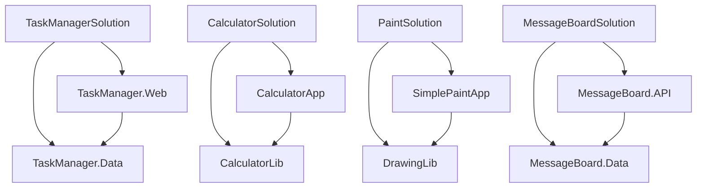

### 1. Resumo Geral do Projeto

O projeto fornecido é um repositório que contém quatro soluções desenvolvidas em .NET Framework 4.8, cada uma explorando diferentes tecnologias e padrões de projeto. As soluções são:

1. **TaskManagerSolution**: Uma aplicação ASP.NET MVC para gerenciar uma lista de tarefas (ToDo List).
2. **CalculatorSolution**: Uma aplicação Windows Forms para realizar operações matemáticas básicas.
3. **PaintSolution**: Uma aplicação WPF para desenhar formas básicas (linhas, retângulos e elipses) em um canvas.
4. **MessageBoardSolution**: Uma aplicação ASP.NET Web API que fornece uma API RESTful para um mural de mensagens.

Cada solução é composta por múltiplos projetos, com uma clara separação entre a interface do usuário e a lógica de negócios ou de dados. As soluções utilizam o .NET Framework 4.8 e dependem de bibliotecas padrão do .NET, como `System.Web`, `System.Windows.Forms`, `PresentationCore`, `PresentationFramework`, e `Newtonsoft.Json`.

### 2. Pontos de Atenção

- **Compatibilidade com .NET 8.0**: Algumas bibliotecas e APIs usadas no .NET Framework 4.8 não são diretamente compatíveis com o .NET 8.0. Isso inclui APIs específicas do Windows, como `System.Web`, `System.Windows.Forms`, e `PresentationCore`.
- **Migração de ASP.NET MVC para ASP.NET Core**: O projeto **TaskManagerSolution** usa ASP.NET MVC, que precisará ser migrado para ASP.NET Core. Isso envolve mudanças significativas na estrutura do projeto, configuração de rotas, e manipulação de dependências.
- **Migração de Windows Forms e WPF**: As soluções **CalculatorSolution** e **PaintSolution** usam Windows Forms e WPF, que são suportados no .NET 8.0, mas apenas no Windows. A migração pode exigir ajustes no código para aproveitar as melhorias do .NET 8.0.
- **Web API**: O projeto **MessageBoardSolution** usa ASP.NET Web API, que precisará ser migrado para ASP.NET Core Web API. Isso envolve mudanças na configuração de rotas, serialização JSON, e manipulação de dependências.
- **Dependências entre Projetos**: Cada solução tem dependências entre projetos, como bibliotecas de classes compartilhadas. Essas dependências precisarão ser ajustadas para o novo formato de projeto do .NET 8.0.

### 3. Bibliotecas que Não Podem Ser Migradas

#### **ASP.NET MVC (System.Web.Mvc)**
- **Motivo**: O ASP.NET MVC não é compatível com o .NET 8.0. Ele foi substituído pelo ASP.NET Core MVC.
- **Impacto**: O projeto **TaskManagerSolution** precisará ser migrado para ASP.NET Core MVC, o que envolve mudanças na configuração de rotas, manipulação de dependências, e estrutura de pastas.
- **Arquivos Impactados**:
  - `TaskManager.Web.csproj`
  - `Web.config`
  - `Global.asax`
  - `Global.asax.cs`

#### **System.Web.Http (ASP.NET Web API)**
- **Motivo**: O ASP.NET Web API foi substituído pelo ASP.NET Core Web API no .NET 8.0.
- **Impacto**: O projeto **MessageBoardSolution** precisará ser migrado para ASP.NET Core Web API, o que envolve mudanças na configuração de rotas, serialização JSON, e manipulação de dependências.
- **Arquivos Impactados**:
  - `MessageBoard.API.csproj`
  - `Web.config`
  - `Global.asax`
  - `Global.asax.cs`

#### **Windows Forms (System.Windows.Forms)**
- **Motivo**: O Windows Forms é suportado no .NET 8.0, mas apenas no Windows.
- **Impacto**: O projeto **CalculatorSolution** pode ser migrado para o .NET 8.0, mas continuará sendo uma aplicação específica para Windows.
- **Arquivos Impactados**:
  - `CalculatorApp.csproj`

#### **WPF (PresentationCore, PresentationFramework)**
- **Motivo**: O WPF é suportado no .NET 8.0, mas apenas no Windows.
- **Impacto**: O projeto **PaintSolution** pode ser migrado para o .NET 8.0, mas continuará sendo uma aplicação específica para Windows.
- **Arquivos Impactados**:
  - `SimplePaintApp.csproj`

#### **Dependências entre Projetos**
- **TaskManagerSolution**: O projeto `TaskManager.Web` depende de `TaskManager.Data`. Essa dependência precisará ser ajustada para o novo formato de projeto do .NET 8.0.
- **CalculatorSolution**: O projeto `CalculatorApp` depende de `CalculatorLib`. Essa dependência precisará ser ajustada para o novo formato de projeto do .NET 8.0.
- **PaintSolution**: O projeto `SimplePaintApp` depende de `DrawingLib`. Essa dependência precisará ser ajustada para o novo formato de projeto do .NET 8.0.
- **MessageBoardSolution**: O projeto `MessageBoard.API` depende de `MessageBoard.Data`. Essa dependência precisará ser ajustada para o novo formato de projeto do .NET 8.0.

### 4. Diagrama de Relacionamento entre os Projetos



### 5. Plano de Ação Organizado por Projeto

#### **TaskManagerSolution**
- **TaskManager.Web.csproj**:
  - Migrar de ASP.NET MVC para ASP.NET Core MVC.
  - Atualizar as referências de `System.Web.Mvc` para `Microsoft.AspNetCore.Mvc`.
  - Ajustar o arquivo `Web.config` para `appsettings.json`.
  - Atualizar o `Global.asax` para usar o `Startup.cs` do ASP.NET Core.
  
  **Snippet de `Startup.cs`**:
  ```csharp
  public class Startup
  {
      public void ConfigureServices(IServiceCollection services)
      {
          services.AddControllersWithViews();
      }

      public void Configure(IApplicationBuilder app, IWebHostEnvironment env)
      {
          if (env.IsDevelopment())
          {
              app.UseDeveloperExceptionPage();
          }
          else
          {
              app.UseExceptionHandler("/Home/Error");
              app.UseHsts();
          }

          app.UseHttpsRedirection();
          app.UseStaticFiles();
          app.UseRouting();
          app.UseAuthorization();

          app.UseEndpoints(endpoints =>
          {
              endpoints.MapControllerRoute(
                  name: "default",
                  pattern: "{controller=Tasks}/{action=Index}/{id?}");
          });
      }
  }
  ```

- **TaskManager.Data.csproj**:
  - Atualizar o formato do projeto para o estilo SDK do .NET 8.0.
  - Verificar se há dependências de bibliotecas externas que precisam ser atualizadas.

#### **CalculatorSolution**
- **CalculatorApp.csproj**:
  - Atualizar o formato do projeto para o estilo SDK do .NET 8.0.
  - Verificar se há dependências de bibliotecas externas que precisam ser atualizadas.
  - Manter o uso de Windows Forms, mas ajustar para aproveitar as melhorias do .NET 8.0.

- **CalculatorLib.csproj**:
  - Atualizar o formato do projeto para o estilo SDK do .NET 8.0.

#### **PaintSolution**
- **SimplePaintApp.csproj**:
  - Atualizar o formato do projeto para o estilo SDK do .NET 8.0.
  - Manter o uso de WPF, mas ajustar para aproveitar as melhorias do .NET 8.0.

- **DrawingLib.csproj**:
  - Atualizar o formato do projeto para o estilo SDK do .NET 8.0.

#### **MessageBoardSolution**
- **MessageBoard.API.csproj**:
  - Migrar de ASP.NET Web API para ASP.NET Core Web API.
  - Atualizar as referências de `System.Web.Http` para `Microsoft.AspNetCore.Mvc`.
  - Ajustar o arquivo `Web.config` para `appsettings.json`.
  - Atualizar o `Global.asax` para usar o `Startup.cs` do ASP.NET Core.

  **Snippet de `Startup.cs`**:
  ```csharp
  public class Startup
  {
      public void ConfigureServices(IServiceCollection services)
      {
          services.AddControllers();
      }

      public void Configure(IApplicationBuilder app, IWebHostEnvironment env)
      {
          if (env.IsDevelopment())
          {
              app.UseDeveloperExceptionPage();
          }
          else
          {
              app.UseExceptionHandler("/Home/Error");
              app.UseHsts();
          }

          app.UseHttpsRedirection();
          app.UseRouting();
          app.UseAuthorization();

          app.UseEndpoints(endpoints =>
          {
              endpoints.MapControllers();
          });
      }
  }
  ```

- **MessageBoard.Data.csproj**:
  - Atualizar o formato do projeto para o estilo SDK do .NET 8.0.

### 6. Sumário em Forma de Tabela

| **Projeto**             | **Complexidade** | **Esforço para Modernização** |
|-------------------------|------------------|-------------------------------|
| **TaskManagerSolution**  | Alta             | Alto                          |
| **CalculatorSolution**   | Média            | Médio                         |
| **PaintSolution**        | Média            | Médio                         |
| **MessageBoardSolution** | Alta             | Alto                          |

### Conclusão

A migração para o .NET 8.0 exigirá um esforço considerável, especialmente para os projetos que utilizam ASP.NET MVC e Web API. As soluções que utilizam Windows Forms e WPF podem ser migradas com menos esforço, mas continuarão sendo específicas para o Windows.