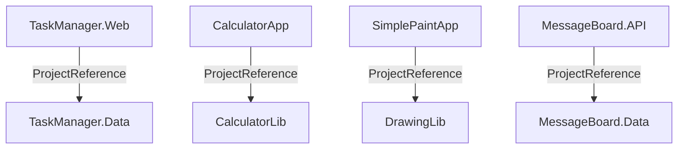

### **1. Resumo Geral do Projeto**

O repositório contém quatro soluções principais desenvolvidas no .NET Framework 4.8, cada uma com diferentes propósitos e arquiteturas:

1. **TaskManagerSolution**: Uma aplicação ASP.NET MVC para gerenciar tarefas (CRUD).
2. **CalculatorSolution**: Uma aplicação Windows Forms para cálculos matemáticos básicos.
3. **PaintSolution**: Uma aplicação WPF para desenhar formas geométricas (linhas, retângulos, elipses).
4. **MessageBoardSolution**: Uma API RESTful ASP.NET Web API para um mural de mensagens.

Cada solução segue boas práticas de separação de responsabilidades, com projetos distintos para interface do usuário, lógica de negócios e dados.

---

### **2. Pontos de Atenção**

1. **Dependências entre Projetos**:
   - Projetos como `TaskManager.Web` e `TaskManager.Data` possuem dependências explícitas via `ProjectReference`.
   - Bibliotecas como `CalculatorLib` e `DrawingLib` são compartilhadas entre projetos.

2. **Configuração Específica do .NET Framework 4.8**:
   - Todos os projetos estão configurados para o .NET Framework 4.8, o que limita a portabilidade direta para .NET 8.0.
   - Arquivos `Web.config` e `App.config` contêm configurações específicas que precisarão ser adaptadas para o .NET moderno.

3. **Persistência de Dados**:
   - Atualmente, os dados são armazenados em memória (listas estáticas). Isso não é escalável e precisará ser substituído por um banco de dados.

4. **APIs e Tecnologias Obsoletas**:
   - Uso de `System.Web` e `System.Web.Mvc` no `TaskManagerSolution` e `MessageBoardSolution`, que não são suportados no .NET moderno.
   - `Windows Forms` e `WPF` são limitados ao Windows, o que restringe a portabilidade para plataformas multiplataforma.

5. **Falta de Testes Automatizados**:
   - Não há projetos de teste para validar a lógica de negócios ou os endpoints da API.

6. **Dependências de Terceiros**:
   - Uso de `Newtonsoft.Json` no `MessageBoardSolution`, que pode ser substituído pelo `System.Text.Json` no .NET moderno.

---

### **3. Bibliotecas que Não Podem Ser Migradas**

#### **Arquivos `.sln` e `.csproj`**
- **Formato Antigo**: Os arquivos `.csproj` utilizam o formato antigo do MSBuild, que não é compatível com o SDK-style project do .NET moderno.
- **Dependências Explícitas**:
  - `ProjectReference` é usado para vincular projetos como `TaskManager.Web` e `TaskManager.Data`.
  - Referências a bibliotecas do .NET Framework, como `System.Web`, `System.Windows.Forms`, `System.Windows`, e `System.Web.Mvc`.

#### **Dependências Específicas**
- **`System.Web` e `System.Web.Mvc`**:
  - Usados no `TaskManagerSolution` e `MessageBoardSolution`.
  - Não são suportados no .NET moderno. Será necessário migrar para o ASP.NET Core.
- **`System.Windows.Forms` e `System.Windows`**:
  - Usados no `CalculatorSolution` e `PaintSolution`.
  - Limitados ao Windows. Não há suporte multiplataforma no .NET moderno.
- **`Newtonsoft.Json`**:
  - Usado no `MessageBoardSolution`. Pode ser substituído por `System.Text.Json`.

#### **Dependências Entre Projetos**
- **TaskManagerSolution**:
  - `TaskManager.Web` depende de `TaskManager.Data`.
- **CalculatorSolution**:
  - `CalculatorApp` depende de `CalculatorLib`.
- **PaintSolution**:
  - `SimplePaintApp` depende de `DrawingLib`.
- **MessageBoardSolution**:
  - `MessageBoard.API` depende de `MessageBoard.Data`.

---

### **4. Diagrama de Relacionamento entre os Projetos**


```mermaid
graph TD
    TaskManager.Web -->|ProjectReference| TaskManager.Data
    CalculatorApp -->|ProjectReference| CalculatorLib
    SimplePaintApp -->|ProjectReference| DrawingLib
    MessageBoard.API -->|ProjectReference| MessageBoard.Data
```

---

### **5. Plano de Ação Organizado por Projeto**

#### **TaskManagerSolution**
1. **Migrar para ASP.NET Core MVC**:
   - Substituir `System.Web.Mvc` por `Microsoft.AspNetCore.Mvc`.
   - Atualizar `Web.config` para `appsettings.json`.
   - Exemplo de migração de rota:
     ```csharp
     // Antes (Global.asax.cs)
     routes.MapRoute(
         name: "Default",
         url: "{controller}/{action}/{id}",
         defaults: new { controller = "Tasks", action = "Index", id = UrlParameter.Optional }
     );

     // Depois (Startup.cs)
     app.UseEndpoints(endpoints =>
     {
         endpoints.MapControllerRoute(
             name: "default",
             pattern: "{controller=Tasks}/{action=Index}/{id?}");
     });
     ```

2. **Adicionar Persistência com EF Core**:
   - Substituir `DataContext` por um `DbContext` do Entity Framework Core.

#### **CalculatorSolution**
1. **Migrar para .NET 8.0**:
   - Atualizar o projeto para o formato SDK-style.
   - Substituir `System.Windows.Forms` por uma alternativa moderna, como `Avalonia` (se multiplataforma for necessária).

2. **Adicionar Testes Automatizados**:
   - Criar um projeto de teste para validar a lógica de `CalculatorLib`.

#### **PaintSolution**
1. **Migrar para .NET 8.0**:
   - Atualizar o projeto para o formato SDK-style.
   - Manter o uso de WPF, mas considerar alternativas multiplataforma, como `Avalonia`.

2. **Refatorar Lógica de Desenho**:
   - Tornar as classes de desenho mais genéricas para facilitar a reutilização.

#### **MessageBoardSolution**
1. **Migrar para ASP.NET Core Web API**:
   - Substituir `System.Web.Http` por `Microsoft.AspNetCore.Mvc`.
   - Atualizar `Web.config` para `appsettings.json`.

2. **Adicionar Persistência com EF Core**:
   - Substituir `MessageRepository` por um `DbContext` do Entity Framework Core.

3. **Substituir `Newtonsoft.Json`**:
   - Usar `System.Text.Json` para serialização/deserialização.

---

### **6. Sumário de Complexidade e Esforço**

| **Projeto**            | **Complexidade** | **Esforço de Modernização** | **Observações**                                                                 |
|-------------------------|------------------|-----------------------------|---------------------------------------------------------------------------------|
| **TaskManagerSolution** | Alta             | Alto                        | Migração para ASP.NET Core MVC e adição de persistência com EF Core.           |
| **CalculatorSolution**  | Média            | Médio                       | Atualização para .NET 8.0 e possível substituição de Windows Forms.            |
| **PaintSolution**       | Média            | Médio                       | Atualização para .NET 8.0 e refatoração da lógica de desenho.                  |
| **MessageBoardSolution**| Alta             | Alto                        | Migração para ASP.NET Core Web API, persistência com EF Core e ajustes de JSON.|

---

Se precisar de mais detalhes ou ajuda com a implementação, posso fornecer exemplos adicionais!